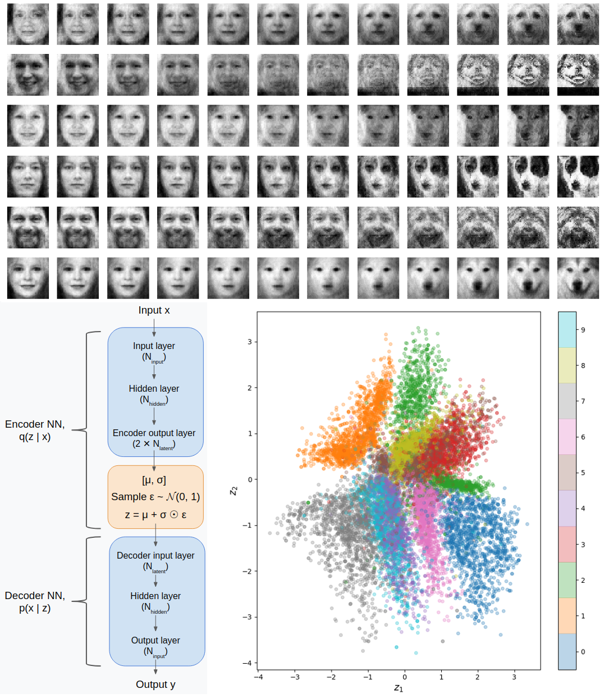

# Variational Autoencoders in Haskell


<p align="center">
  
</p>

## Overview

This is the repo for a project I did to learn some Haskell, investigating Variational Autoencoders (VAE). You can read the much more in depth, accompanying [blog post here](https://www.declanoller.com/2019/11/15/variational-autoencoders-in-haskell-or-how-i-learned-to-stop-worrying-and-turn-my-friends-into-dogs/). I first tested it with the classic MNIST digits, and then tried encoding both humans and dogs simultaneously for fun.

It's based on the Haskell [hmatrix](https://hackage.haskell.org/package/hmatrix-0.16.0.2/docs/Numeric-LinearAlgebra-HMatrix.html) library, which only supports 1D vectors and 2D matrices, but worked well enough here. In it, I implement a NN type, and then a VAE type that's built from NN types. I also implement the [Adam optimizer](https://arxiv.org/abs/1412.6980) to do the gradient descent.

## Data

The human faces data is the [UTKFace dataset](https://susanqq.github.io/UTKFace/) and the dogs are from the [Columbia University dogs dataset](https://people.eecs.berkeley.edu/~kanazawa/). I did a bunch of preprocessing I'll talk about in another post/repo.

Here are a sample of images from each:

<p align="center">
  
</p>

<p align="center">
  
</p>


## Use

This project was built using Cabal 3. It's beyond the scope of this (i.e., it's a bit of a nightmare) to explain how to configure that, but assuming you have, doing

```
cabal run
```

should build and run the file with `main`, `vae.hs`.

To briefly explain what's going on inside there...

```
let train_info = TrainInfo  { batch_size = 32
                            , batches_per_epoch = 100
                            , n_epochs = 100
                            , lr = 0.001
                            , beta_KL_max = 0.00
                            , beta_KL_method = "constant"
                            }


    data_info_mnist = DataInfo  { n_input = 784
                                , n_tot_samples = 60000
                                , prefix = "mnist"
                                , data_dir = "mnist_data/"
                                }
```

a `TrainInfo` and `DataInfo` record each have to be defined. The `TrainInfo` record determines train parameters you want to use (see the ones in there). `beta_KL_method` selects which scheme for `beta_KL` you'd like to use; the simplest is "constant", in which case it's...constant, but other schemes, like a delayed ramp, or a sigmoidal ramp, can be used. `beta_KL_max` will determine the maximum `beta_KL` value that it goes up to (if it's a scheme that varies; if it's constant, that's the constant value).

The `DataInfo` record has info particular to that dataset. It could be figured out automatically, but it was simpler just to give it the info: the input size (mnist is 784=28x28 flattened), 60k total samples, will use the `prefix` to name output fies, and the data is stored in `data_dir`.

```
vae <- build_vae [(n_input data_info), n_hidden, n_latent]
```

This uses the `build_vae` to build a VAE type with number of layers based on the numbers you give it. The first number should be the input size, then as many numbers as hidden layers you want. The last number should be the size of the latent dimension that you want. In this case, it only has a single hidden layer (in each of the encoder and decoder). Note that building the VAE automatically builds two NNs inside of it; the encoder NN will have layer sizes `[n_input, n_hidden, 2*n_latent]` and the decoder will have layer sizes `[n_latent, n_hidden, n_input]`.

```
let vae_adam_optim = get_init_adam_optim vae (lr train_info)
```
Similarly, this uses the sizes of the `vae` just built to built the Adam optimizer.


```
(new_vae, new_vae_optim, new_train_stats) <- train_n_epochs vae vae_adam_optim train_info data_info
```

Lastly, you pass the VAE, its optimizer, the `TrainInfo` record, and the `DataInfo` record to `train_n_epochs`, which will repeatedly run through the data, import it, read it, do forward passes, do backward passes, and optimize the weights with gradient descent.


## Results

It works very well with MNIST, using a hidden layer of 1,000 and a latent space of 2. For explanations of these, please see the blog post!

No KL div loss:

<p align="center">
  
</p>


<p align="center">
  
</p>


0.0001 `beta_KL`, delayed ramp:


<p align="center">
  
</p>


<p align="center">
  
</p>


<p align="center">
  
</p>


-
